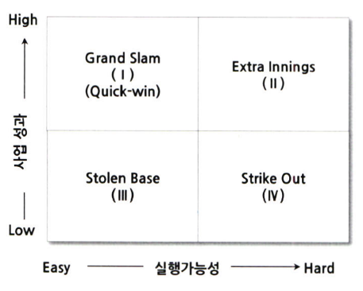
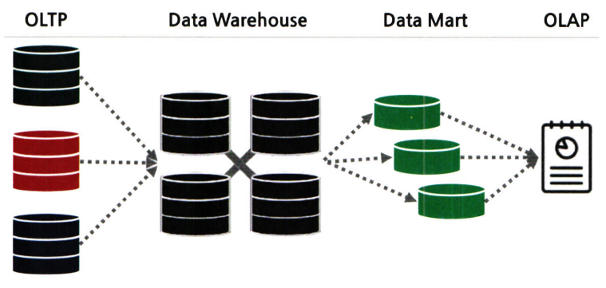
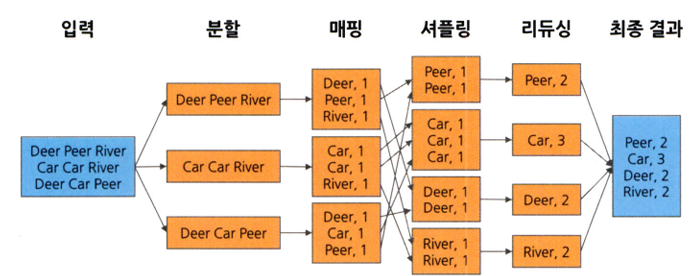
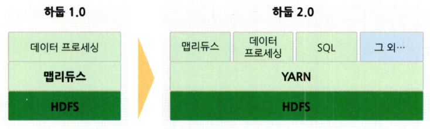
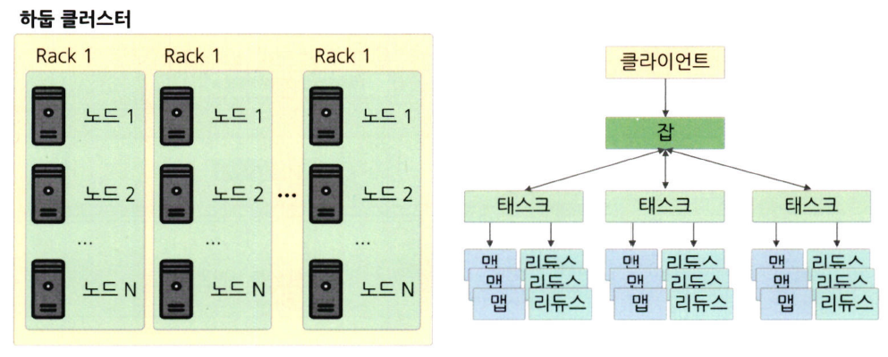
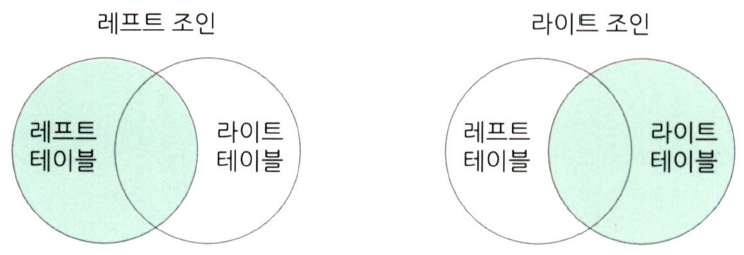
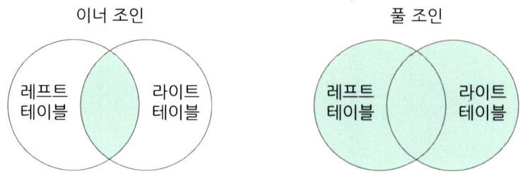
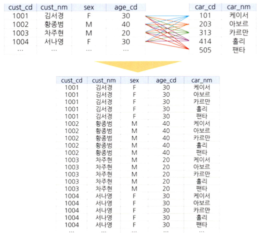
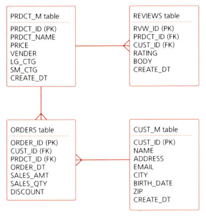
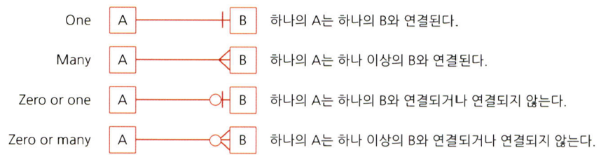

# 통계학 3주차 정규과제

📌통계학 정규과제는 매주 정해진 분량의 『*데이터 분석가가 반드시 알아야 할 모든 것*』 을 읽고 학습하는 것입니다. 이번 주는 아래의 **Statistics_3rd_TIL**에 나열된 분량을 읽고 `학습 목표`에 맞게 공부하시면 됩니다.

아래의 문제를 풀어보며 학습 내용을 점검하세요. 문제를 해결하는 과정에서 개념을 스스로 정리하고, 필요한 경우 추가자료와 교재를 다시 참고하여 보완하는 것이 좋습니다.

2주차는 `2부-데이터 분석 준비하기`를 읽고 새롭게 배운 내용을 정리해주시면 됩니다.


## Statistics_3rd_TIL

### 2부. 데이터 분석 준비하기
### 08. 분석 프로젝트 준비 및 기획
### 09. 분석 환경 세팅하기


## Study Schedule

|주차 | 공부 범위     | 완료 여부 |
|----|----------------|----------|
|1주차| 1부 p.2~56     | ✅      |
|2주차| 1부 p.57~79    | ✅      | 
|3주차| 2부 p.82~120   | ✅      | 
|4주차| 2부 p.121~202  | 🍽️      | 
|5주차| 2부 p.203~254  | 🍽️      | 
|6주차| 3부 p.300~356  | 🍽️      | 
|7주차| 3부 p.357~615  | 🍽️      |  

<!-- 여기까진 그대로 둬 주세요-->

# 08. 분석 프로젝트 준비 및 기획

```
✅ 학습 목표 :
* 데이터 분석 프로세스를 설명할 수 있다.
* 비즈니스 문제를 정의할 때 주의할 점을 설명할 수 있다.
* 외부 데이터를 수집하는 방법에 대해 인식한다.
```
<!-- 새롭게 배운 내용을 자유롭게 정리해주세요.-->
## 8.1. 분석 프로젝트 준비 및 기획
**데이터 분석의 궁극적인 목표: 의사결정 프로세스의 최적화**

### 8.1.1. 데이터 분석의 3단계

```
초반부에는 비즈니스 문제와 해결 방향을 명확히 정의하고 데이터를 탐색한다.
중반부에는 데이터를 목적에 맞도록 수집 및 가공하고 필요에 따라 머신러닝 모델을 사용한다.
후반부에는 데이터 분석 결과를 검토 및 검증하고 실제 환경에 적용한다.
이후에는 적용한 방법의 효과를 지속적으로 모니터링하고 성과를 측정하고 보완하는 단계가 수반되어야 한다. 
```
### 8.1.2. CRISP-DM 방법론

---
1. 비즈니스 이해
- 현재 상황 평가
- 데이터 마이닝 목표 결정
- 프로젝트 계획 수립

2. 데이터 이해
- 데이터 설명
- 데이터 탐색
- 데이터 품질 확인

3. 데이터 준비
- 데이터 선택
- 데이터 정제
- 필수 데이터 구성
- 데이터 통합

4. 모델링
- 모델링 기법 선정
- 테스트 디자인 생성
- 모델 생성
- 모델 평가

5. 평가
- 결과 평가
- 프로세스 검토
- 다음 단계 결정

6. 배포
- 배포 계획
- 모니터링 및 유지 관리 계획
- 최종 보고서 작성
- 프로젝트 검토

### 8.1.3. SAS SEMMA 방법론

---
1. Sampling
- 전체 데이터에서 분석용 데이터 추출
- 의미 있는 정보를 추출하기 위한 데이터 분할 및 병합
- 표본추출을 통해 대표성을 가진 분석용 데이터 생성
- 분석 모델 생성을 위한 학습, 검증, 테스트 데이터셋 분할

2. Exploration 
- 통계치 확인, 그래프 생성 등을 통해 데이터 탐색
- 상관분석, 클러스터링 등을 통해 변수 간의 관계 파악
- 분석 모델에 적합한 변수 선정
- 데이터 현황을 파악하여 비즈니스 아이디어 도출 및 분석 방향 수정

3. Modification 
- 결측값 처리 및 최종 분석 변수 선정
- 로그변환, 구간화 등 데이터 가공
- 주성분분석 등을 통해 새로운 변수 생성

4. Modeling 
- 다양한 데이터마이닝 기법 적용에 대한 적합성 검토
- 비즈니스 목적에 맞는 분석 모델을 선정하여 분석 알고리즘 적용
- 지도학습, 비지도학습, 강화학습 등 데이터 형태에 따라 알맞은 모델 선정
- 분석 환경 인프라 성능과 모델 정확도를 고려한 모델 세부 옵션 설정

5. Assessment 
- 구축한 모델들의 예측력 등 성능을 비교, 분석, 평가
- 비즈니스 상황에 맞는 적정 임계치 설정
- 분석 모델 결과를 비즈니스 인사이트에 적용
- 상황에 따라 추가적인 데이터 분석 수행

## 8.2. 비즈니스 문제 정의와 분석 문제 도출
#### 🔍 MECE(Mutually Exclusive Collectively Exhaustive)
- 비즈니스 문제를 위한 논리적 접근법 중 하나
- 세부 정의들이 서로 겹치지 않고 전체를 합쳤을 때는 빠진 것 없이 완전히 전체를 이루는 것
- 일반적으로 로직 트리를 활용하여 세부 항목 정리


** 비즈니스 문제는  현상에 대한 설명으로 끝나서는 안 되고, 본질적인 문제점이 함께 전달되어야 한다.
#### 🔍 페이오프 매트릭스


## 8.3. 분석 목적의 전환
- 분석 프로젝트의 방향은 언제든 바뀔 수 있다. 다만, 바뀌는 순간을 확실히 인지하고, 신속히 공유하여야 한다.
- 분석 프로젝트를 수행하는 동안에는 실무자들 간의 커뮤니케이션 및 협력이 매우 중요하다.
    - 협력을 이끌어내기 위해서는 초기 데이터 탐색을 통해 도출할 수 있는 간단한 상관관계나 데이터 특성 그리고 시각화를 적극 활용해야 한다.

## 8.4. 도메인 지식
- 해당되는 분야의 업에 대한 이해도
- 직접 의미 있는 변수를 찾아내고 분석 방향을 설정하는 것은 도메인 지식이 충분할 때 가능하다.
- 기본적으로 데이터가 생성되는 현장을 직접 보고 소비자 혹은 사용자의 입장이 되어 경험을 해보는 것이 좋다.
## 8.5. 외부 데이터 수집과 크롤링
- 외부 데이터 수집 방법
    - 데이터 구매
    - 오픈 데이터 수집
    - 크롤링
        - 크롤링: 웹 페이지가 주어지면 그 페이지 내에 있는 링크들을 따라가면서 모든 내용을 다 가져오는 것
        - 스크래핑: 웹 페이지에서 자신이 원하는 부분의 정보만 가져오는 것

- 일반적으로 웹사이트에서는 robots.txt 파일을 심어 두어 접속 주체에 따라 크롤링 허용 범위를 안내하고 있다.
```
User-agent: 대상 크롤러(모든 검색 봇, 구글 봇 등)
Allow: 허용하는 경로
Disallow: 허용하지 않는 경로
```
# 09. 분석 환경 세팅하기

```
✅ 학습 목표 :
* 데이터 분석의 전체적인 프로세스를 설명할 수 있다.
* 테이블 조인의 개념과 종류를 이해하고, 각 조인 방식의 차이를 구분하여 설명할 수 있다.
* ERD의 개념과 역할을 이해하고, 기본 구성 요소와 관계 유형을 설명할 수 있다.
```

<!-- 새롭게 배운 내용을 자유롭게 정리해주세요.-->
## 9.1. 어떤 데이터 분석 언어를 사용하는 것이 좋을까?

- 데이터 전처리는 주로 SQL과 파이썬을 조합하여 코드를 짜고, ML 모델은 사이킷런 등의 패키지 활용.
## 9.2. 데이터 처리 프로세스 이해하기

- OLTP(On-Line Transaction Processing): 실시간으로 데이터를 트랜잭션 단위로 수집, 분류, 저장하는 시스템
- DW: 데이터 창고와 같은 개념으로, 수집된 데이터를 사용자 관점에서 주제별로 통합하여 쉽게 원하는 데이터를 빼낼 수 있도록 저장해 놓은 통합 데이터베이스
- DM: 사용자의 목적에 맞도록 가공된 일부의 데이터가 저장되는 곳

#### 🔍 ETL
```
Extract: 원천 소스 데이터베이스로부터 필요한 데이터를 읽어 들이는 과정

Transform: 미변환 상태의 raw 데이터를 정리, 필터링, 정형화하고 요약하여 분석에 적합한 상태로 바꾸어 놓는 과정

Load: 변환된 데이터를 새로운 테이블(목표 시스템)에 적재하는 과정
```
## 9.3. 분산데이터 처리
- 한 컴퓨터가 처리해야 할 일을 여러 컴퓨터가 나눠서 한 뒤, 그 결과를 합치는 것
    - scale-up 방식: 하나의 컴퓨터의 용량을 늘리고 더 빠른 프로세서를 탑재하는 것
    - scale-out 방식: 여러 대의 컴퓨터를 병렬적으로 연결하는 것

- 데이터 처리 속도를 높이기 위해서는, 연결된 컴퓨터들이 효율적으로 데이터를나눠서 처리하고 결과를 취합할 수 잇는 기술이 필요하다.
    - 대표적으로 HDFS와 맵리듀스가 있다. 
    - HDFS는
        1. 데이터를 저장하고 계산하는 `슬레이브 노드`
        2.  대량의 데이터를 HDFS에 저장하고 맵리듀스 방식을 통해 데이터를 병렬 처리하는 `마스터 노드`
        3. 맵리듀스 작업을 통해 산출된 결과를 보여주는 `클라이언트 머신`<br>
        
        으로 구성되어 있다.
### 9.3.1. HDFS
#### 🔍 맵리듀스
- `맵`과 `리듀스`라는 두 단계로 구성.
- 맵 단계: 흩어져 있는 데이터를 관련된 데이터끼리 묶어서 임시의 집합을 만드는 과정
- 리듀스 단계: 필터링과 정렬을 거쳐 데이터를 뽑아냄

- 맵리듀스의 중요한 특징은 key-value 쌍으로 데이터를 처리한다는 것.


- 맵리듀스의 단계
```
1. 분할: 입력된 데이터를 고정된 크기의 조각으로 분할한다.
2. 매핑: 분할된 데이터를 key-value 형태로 묶어주고 단어 개수를 계산한다.
3. 셔플링: 매핑 단계의 counting 결과를 정렬 및 병합한다.
4. 리듀싱: 각 결과를 취합 및 계산하여 최종 결괏값을 산출한다.
```


#### 🔍 하둡



#### 🔍 분산 시스템 구조


노드=하나의 컴퓨터 -> 랙 -> 클러스터<br>

클라이언트 -> 잡 -> 태스크 -> 맵&리듀스
### 9.3.2. 아파치 스파크
HDFS는 데이터 전송, 분산 파일 시스템, 분산 데이터 처리, 운영 관리 레이어로 구분되는데, `스파크는 분산 데이터 처리를 담당`

## 9.4. 테이블 조인과 정의서 그리고 ERD
### 9.4.1.  테이블 조인


- 크로스 조인
    
### 9.4.2.  데이터 단어사전
#### 🔍 데이터 단어사전
말 그대로 각 칼럼과 테이블의 이름을 정할 때 체계를 약속한 일종의 사전
#### 🔍 메타데이터 관리 시스템
데이터가 어디에 어떻게 저장되어 있는지, 그리고 데이터를 어떻게 사용할 것인지 이해할 수 있도록 데이터에 대한 정보를 관리하는 시스템
### 9.4.3.  테이블 정의서
각 DW, DM 등에 정재된 테이블과 칼럼의 한글과 영문명, 데이터 속성, 그리고 간단한 설명 등이 정리된 표
### 9.4.4.  ERD(Entity Realtionship Diagram)
각 테이블의 구성 정보와 테이블 간 관계를 도식으로 표현한 그림 형태로 구성


- 물리 ERD: DB를 효율적이고 결점 없이 구현하는 것을 목표로 구현하는 ERD 개념
- 논리 ERD: 데이터 사용자 입장에서 테이블 간 매핑(Mapping)에 오류가 없으며 데이터의 정규화가 이루어진 ERD의 개념

#### 🔍 기본 키와 외래 키
- 기본 키: 테이블에 적재된 각각의 데이터를 유일하게 구분하는 키
- 외래 키: 각 테이블 간에 연결을 만들기 위해서 테이블에서 다른 테이블의 참조되는 기본 키

#### 🔍 ERD 연결 관계 그림

- 관계의 종류가 다양하기 때문에, 관계를 정확히 파악하고 데이터를 다뤄야 한다.
<br>
<br>

# 확인 문제

## 문제 1.

> **🧚 아래의 테이블을 조인한 결과를 출력하였습니다. 어떤 조인 방식을 사용했는지 맞춰보세요.**

> 사용한 테이블은 다음과 같습니다.

|
---|---|

> 보기: INNER, LEFT, RIGHT 조인

<!-- 테이블 조인의 종류를 이해하였는지 확인하기 위한 문제입니다. 각 테이블이 어떤 조인 방식을 이용하였을지 고민해보고 각 테이블 아래에 답을 작성해주세요.-->

### 1-1. 

```
LEFT JOIN
```

### 1-2. 

```
INNER JOIN
```

### 1-3. 

```
RIGHT JOIN
```

### 🎉 수고하셨습니다.